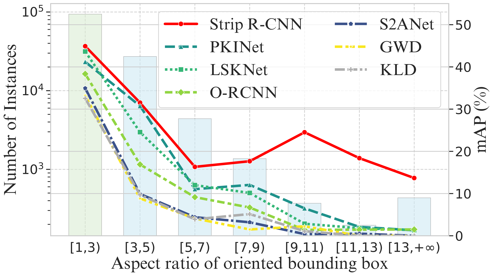

<h1 align="center">Strip R-CNN: Large Strip Convolution for Remote Sensing Object Detection</h1>

<div align="center">
<b>
  <a href="https://github.com/YXB-NKU">Xinbin Yuan</a>, 
  <a href="https://scholar.google.com.hk/citations?hl=zh-CN&user=0X71NDYAAAAJ">ZhaoHui Zheng</a>, 
  <a href="https://scholar.google.com.hk/citations?hl=zh-CN&user=vKnUqmMAAAAJ">Yuxuan Li</a>, 
  <a href="">Xialei Liu</a>, 
  <a href="">Li Liu</a>, 
  <a href="">Xiang Li</a>, 
  <a href="">Qibin Hou*</a>, 
  <a href="">Ming-Ming Cheng</a>
</b>


[](https://arxiv.org/abs/2501.03775)
<a href='https://zhuanlan.zhihu.com/p/17342348259'></a>

<p>If you find our work helpful, please consider giving us a ⭐!</p>

</div>


[](https://paperswithcode.com/sota/object-detection-in-aerial-images-on-dota-1?p=strip-r-cnn-large-strip-convolution-for)





Offical implementation of "Strip R-CNN: Large Strip Convolution for Remote Sensing Object Detection"

we also add our config in https://github.com/zcablii/LSKNet

# Citation
If you like our work, don't hesitate to reach out! Let's work on it and see how far it would go!
```bibtex
@article{yuan2025strip,
  title={Strip R-CNN: Large Strip Convolution for Remote Sensing Object Detection},
  author={Yuan, Xinbin and Zheng, ZhaoHui and Li, Yuxuan and Liu, Xialei and Liu, Li and Li, Xiang and Hou, Qibin and Cheng, Ming-Ming},
  journal={arXiv preprint arXiv:2501.03775},
  year={2025}
}
```